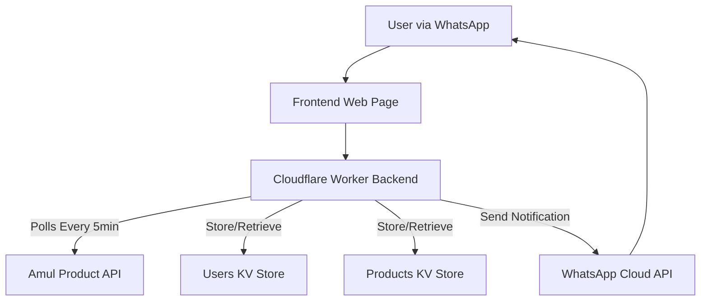

# Amul Protein Back-in-Stock Notification System

A notification system that monitors Amul protein products on shop.amul.com and sends WhatsApp notifications when selected products are back in stock. Built with Cloudflare Workers for serverless backend and a clean web interface for user subscriptions.

## Features

- **Product Monitoring**: Automatically monitors Amul protein products every 5 minutes
- **WhatsApp Notifications**: Direct notifications via WhatsApp Cloud API when products are back in stock
- **User-Friendly Interface**: Clean web interface for product selection and subscription management
- **Real-time Updates**: Dynamic product list fetched directly from Amul's API
- **Serverless Architecture**: Powered by Cloudflare Workers for scalability and cost-effectiveness
- **Persistent Storage**: User subscriptions and product status stored in Cloudflare Workers KV
- **Subscription Management**: Subscribe to multiple products and manage subscriptions

## Architecture



## Technology Stack

### Backend
- **Cloudflare Workers**: Serverless execution environment with TypeScript
- **Cloudflare Workers KV**: Two KV stores for data persistence:
  - `USERS_KV`: User subscriptions (phone numbers, emails, product preferences)
  - `PRODUCTS_KV`: Product stock status tracking
- **WhatsApp Cloud API**: Direct WhatsApp messaging with template support
- **Cron Triggers**: Automated 5-minute stock checks
- **Vitest**: Testing framework

### Frontend
- **HTML5**: Clean, semantic structure with subscription forms
- **CSS3**: Responsive styling for all devices
- **Vanilla JavaScript**: Lightweight client-side logic for form handling and API communication
- **Dynamic Product Loading**: Real-time product list from Amul API

## Quick Start

### Prerequisites

- Cloudflare account with Workers plan
- WhatsApp Business Account with Cloud API access
- Node.js (v18 or higher)
- Wrangler CLI (`npm install -g wrangler`)

### Environment Variables Required

```bash
# WhatsApp Cloud API Configuration
WHATSAPP_ACCESS_TOKEN=your_permanent_access_token
WHATSAPP_PHONE_NUMBER_ID=your_phone_number_id
WHATSAPP_API_VERSION=v21.0

# Amul API Configuration
AMUL_API_URL=https://shop.amul.com/api/products
```

### Setup

1. **Clone the repository**
   ```bash
   git clone <repository-url>
   cd back-in-stock-notifications
   ```

2. **Install Worker dependencies**
   ```bash
   cd worker
   npm install
   ```

3. **Configure Cloudflare KV Stores**
   ```bash
   # Create KV namespaces
   npx wrangler kv:namespace create "USERS_KV"
   npx wrangler kv:namespace create "PRODUCTS_KV"
   
   # Add the IDs to wrangler.jsonc
   ```

4. **Set environment variables**
   ```bash
   # Set secrets for production
   npx wrangler secret put WHATSAPP_ACCESS_TOKEN
   npx wrangler secret put WHATSAPP_PHONE_NUMBER_ID
   ```

5. **Deploy the Worker**
   ```bash
   cd worker
   npm run deploy
   ```

6. **Deploy the Frontend**
   ```bash
   # Deploy to Cloudflare Pages
   npx wrangler pages deploy frontend
   ```

## Development

### Local Development

```bash
cd worker
npm run dev
```

This starts the Cloudflare Worker locally at `http://localhost:8787` with hot reloading.

### Testing

```bash
cd worker
npm test
```

Run the test suite using Vitest.

### Generate Types

```bash
cd worker
npm run cf-typegen
```

Generate TypeScript types for your Cloudflare Worker environment.

## API Endpoints

The Cloudflare Worker provides these endpoints:

### `GET /products`
Fetch current Amul protein products for the dropdown selection.

**Response:**
```json
[
  {
    "_id": "product_id",
    "name": "Product Name",
    "alias": "product-alias",
    "available": 1,
    "inventory_quantity": 10,
    "price": 299,
    "images": [{"image": "image_url"}]
  }
]
```

### `POST /subscribe`
Subscribe to product notifications.

**Request:**
```json
{
  "phoneNumber": "+919876543210",
  "email": "user@example.com", // Optional
  "productIds": ["product_id_1", "product_id_2"]
}
```

### `POST /unsubscribe`
Remove subscriptions (specific products or all).

**Request:**
```json
{
  "phoneNumber": "+919876543210",
  "productIds": ["product_id_1"] // Optional - omit to unsubscribe from all
}
```

## How It Works

1. **User Registration**: Users visit the web interface, enter their WhatsApp number, and select Amul protein products to monitor
2. **Stock Monitoring**: Cloudflare Worker polls Amul's API every 5 minutes via cron trigger
3. **Change Detection**: System compares current stock status (`available` and `inventory_quantity` fields) with previously stored data in `PRODUCTS_KV`
4. **Notification**: When a monitored product comes back in stock, WhatsApp notifications are sent to subscribed users using the WhatsApp Cloud API
5. **Subscription Management**: Users can subscribe to multiple products or unsubscribe through the web interface

## WhatsApp Integration

### Template Configuration
The system uses WhatsApp Cloud API with message templates:

- **Current**: Uses `hello_world` template for initial testing
- **Production**: Requires a custom approved template for back-in-stock notifications

### Template Structure (For Approval)
```json
{
  "name": "back_in_stock",
  "language": "en_US",
  "components": [
    {
      "type": "body",
      "text": "Great news! {{1}} is back in stock. Order now: {{2}}"
    },
    {
      "type": "button",
      "sub_type": "url",
      "index": 0,
      "parameters": [{"type": "text", "text": "{{1}}"}]
    }
  ]
}
```

### Compliance Features
- **Opt-in Requirement**: Clear checkbox for WhatsApp consent
- **Direct Links**: Notifications include product name and purchase link
- **Error Handling**: Comprehensive logging for failed message delivery
- **Rate Limiting**: Respects WhatsApp API limits

## Data Storage

### Users KV Store (`USERS_KV`)
Stores user subscription data:
```json
{
  "phoneNumber": "+919876543210",
  "email": "user@example.com",
  "subscribedProductIds": ["product_id_1", "product_id_2"]
}
```

### Products KV Store (`PRODUCTS_KV`)
Tracks product stock status for change detection:
```json
{
  "available": 1,
  "inventory_quantity": 10
}
```

## Deployment

### Automated Deployment (GitHub Actions)
The project includes workflows for automatic deployment:

- **Worker**: `.github/workflows/deploy-worker.yml`
- **Frontend**: `.github/workflows/deploy-frontend.yml`

### Manual Deployment

```bash
# Deploy worker
cd worker
npm run deploy

# Deploy frontend
npx wrangler pages deploy frontend
```

## Project Structure

```
├── frontend/              # Static web interface
│   ├── index.html        # Main subscription page with forms
│   ├── script.js         # Frontend JavaScript for API calls
│   └── style.css         # Responsive styling
├── worker/               # Cloudflare Worker backend
│   ├── src/
│   │   └── index.ts      # Main worker logic with API endpoints
│   ├── test/             # Test suite
│   ├── package.json      # Dependencies and scripts
│   ├── wrangler.jsonc    # Worker configuration with cron triggers
│   └── tsconfig.json     # TypeScript configuration
├── memory-bank/          # Project documentation and context
├── .github/workflows/    # CI/CD pipelines
└── README.md            # This file
```

## Configuration

### Cron Triggers (`wrangler.jsonc`)
```json
{
  "triggers": {
    "crons": ["*/5 * * * *"]
  }
}
```

### KV Bindings
```json
{
  "kv_namespaces": [
    { "binding": "USERS_KV", "id": "your-users-kv-id" },
    { "binding": "PRODUCTS_KV", "id": "your-products-kv-id" }
  ]
}
```

## Stock Detection Logic

The system detects when products are back in stock by comparing:

1. **Available Status**: `product.available` changes from `0` to `1`
2. **Inventory Quantity**: `product.inventory_quantity` changes from `0` to any positive number
3. **New Products**: Products not previously tracked are considered "back in stock"

## Error Handling

- **API Failures**: Graceful handling of Amul API downtime
- **WhatsApp Delivery**: Comprehensive logging for failed messages
- **Data Integrity**: Validation of user inputs and product IDs
- **Rate Limiting**: Respects external API limits

## Contributing

1. Fork the repository
2. Create a feature branch (`git checkout -b feature/amazing-feature`)
3. Make your changes
4. Add tests for new functionality
5. Ensure code quality (`npm run test`)
6. Commit your changes (`git commit -m 'Add amazing feature'`)
7. Push to the branch (`git push origin feature/amazing-feature`)
8. Open a Pull Request

## Monitoring

- **Stock Checks**: Automated every 5 minutes via cron triggers
- **Logging**: Comprehensive console logging for debugging
- **User Management**: Track subscriptions and notification delivery
- **API Health**: Monitor Amul API response status

## Future Enhancements

- Email fallback notifications
- Product price change alerts
- Subscription analytics dashboard
- Custom notification frequency per user
- Multi-language support
- Advanced filtering options

## License

This project is open source and available under the [MIT License](LICENSE).

## Support

For issues and questions:
- Open an issue in the GitHub repository
- Check the `memory-bank/` documentation for detailed project context
- Review Cloudflare Workers and WhatsApp Cloud API documentation

## Acknowledgments

- Built for monitoring Amul protein products on [shop.amul.com](https://shop.amul.com)
- Powered by Cloudflare's edge computing platform
- WhatsApp Business messaging integration
- TypeScript for type-safe development
